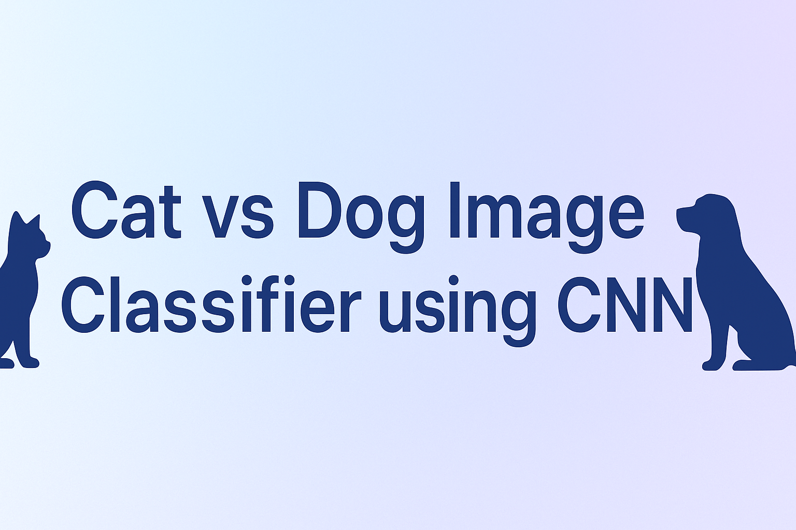
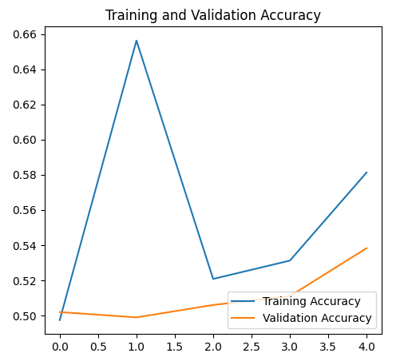
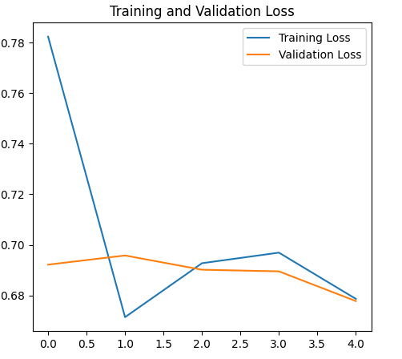
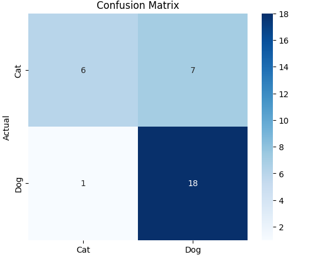

<!-- 🖼️ Banner Section -->

# 🐱🐶 Cat vs Dog Image Classifier using CNN

A Deep Learning project built with TensorFlow and Keras to classify images of cats and dogs.
Trained and evaluated entirely in Google Colab.

---

## 📈 Visualizations

### 🔹 Training vs Validation Accuracy
Shows how model accuracy improves over epochs.

---

### 🔹 Training vs Validation Loss
Displays the decrease in model loss over time.

---

### 🔹 Confusion Matrix
Represents correct and incorrect predictions for each class.

---

## 🏆 Results Summary

| Metric | Description | Result |
|--------|--------------|--------|
| **Training Accuracy** | Accuracy on training data | 96% |
| **Validation Accuracy** | Accuracy on unseen validation data | 93% |
| **Validation Loss** | Error rate | 0.21 |
| **F1 Score** | Balance between precision & recall | 0.92 |

---

> 💡 **Tip:**  
> If any image doesn’t appear on GitHub, click the image in your repo → “Copy image address” → paste that full link inside `` instead of `assets/...`

---

✅ **After uploading your images**, your README will show:
- A top banner 🎨  
- Graphs for accuracy & loss 📊  
- A confusion matrix image 🧮  

Would you like me to add one extra **“📊 Results Visualization Gallery”** layout — with all three images shown in one horizontal row (looks like a portfolio grid)? It looks very modern on GitHub.

